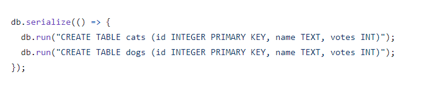
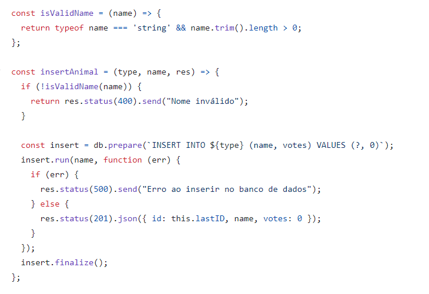
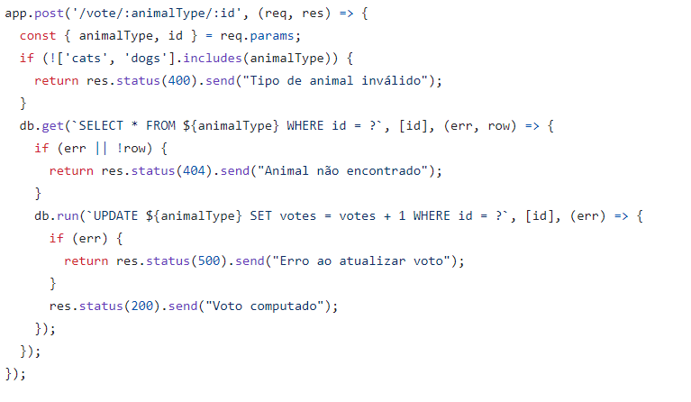

# 20232BSET03P2
Inteli - Engenharia de Software | Avaliação 2023-2B P2
 
Uma das vulnerabilidades que pode ser encontra foi que ao criar a tabela o ID dos dados presentes nela era inteiros, fazendo com que a pessoa pudesse escolher qual o ID, essa mudança fez com que o ID seja inserido de forma automatica.
 

 

A segunda mudança foi para evitar o SQL injection da qual adicionamos o metodo prepare seguido do metodo run que faz com que os dados sejam passados como dados e não como comando SQL, ela tambem garante que o nome do animal não seja vazio e faz com que o animal seja sempre postado com 0 votos. 
 

 
A terceira mudança foi feita para verificar se o tipo de animal existe, caso o tipo de animal exista ele busca o id do animal, caso o id não exista retorna um erro e caso exista retorna sucesso e posta o voto para o animal, caso ocorra algum erro no processo o erro é retornado.
 

 

Haviam algumas funções vazias das quais continham apenas um endpoint, isso não existe mais no novo codigo e todas as funções retornam erros dos quais explicam o por que do erro ter ocorrido.
